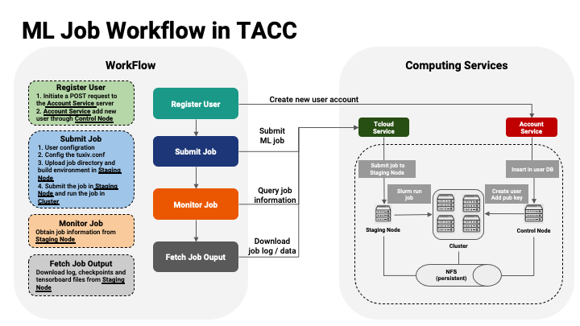
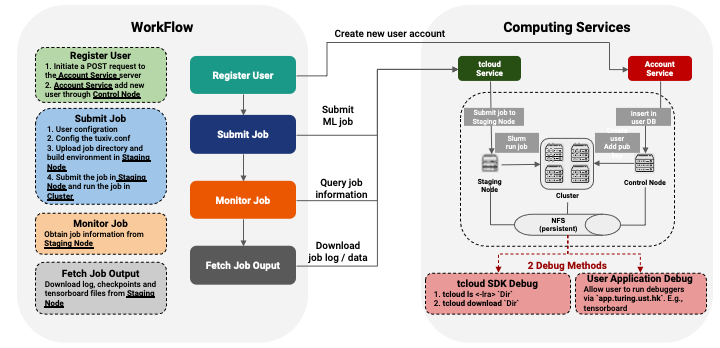

# TACC Quick Start
## Workflow Overview

The above picture illustrates TACC job submission workflow.

The above picture illustrates TACC job debugging workflow.
## Download tcloud SDK

## Examples
Basic examples are provided under the [example](examples) folder. These examples include: [TensorFlow](TensorFlow), [PyTorch](PyTorch) and [MXNet](MXNet).