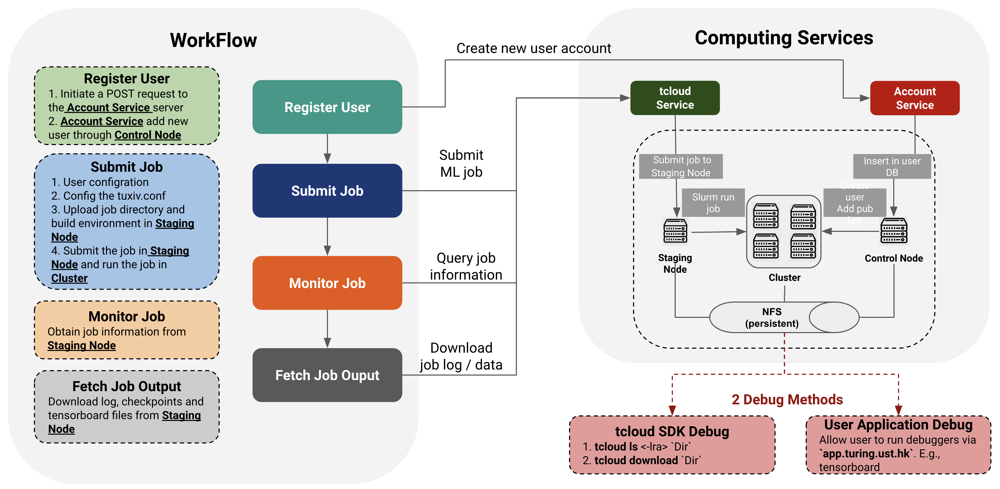

# TACC Quick Start
## Workflow Overview



The above picture illustrates TACC job submitting and debugging workflow.

## Download/Install tcloud SDK
- __Download tcloud SDK__ \
Download latest tcloud SDK from [tags](https://github.com/turingaicloud/quickstart/tags).
- __Install tcloud SDK__ \
Place `setup.sh` and `tcloud` in the same directory, and run `setup.sh`.

## Configuration
### CLI Configuration
Before using the tcloud CLI and submit ML jobs to TACC, you need to configure your TACC credentials. You can do this by running the `tcloud config` command:
```
$ tcloud config [-u/--username] MYUSERNAME
$ tcloud config [-f/--file] MYFILEPATH
```

### Job Configuration
#### TUXIV.CONF

You can use `tcloud init` to initialize the job configuration. `tcloud init` will create a template configuration file named `tuxiv.conf` . There are four parts in `tuxiv.conf`, config different parts of job submission. Noted that `tuxiv.conf` follows the yaml format.

+ Entrypoint

  In this section, you should insert you shell commands to run your code line-by-line. The tcloud CLI will run the job as your configurations.

  ~~~yaml
  entrypoint:
      - python ${TACC_WORKDIR}/mnist.py --epoch=3
  ~~~

+ Environment

  In this section, you can specify your conda configurations for virtual environment used in the cluster, including environment name, dependencies, source channels and so on.

  ~~~yaml
  environment:
      name: torch-env
      dependencies:
          - pytorch=1.6.0
          - torchvision=0.7.0
      channels: pytorch
  ~~~

+ Job

  In this section, you can specify your slurm configurations for slurm cluster resources, including number of nodes, CPUs, GPUs and so on. All the slurm cluster configuration should be set in the general part.

  ~~~yaml
  job:
      name: test
      general:
          - nodes=2
  ~~~

+ Datasets

  In this section, you can specify the data location or url for your job.

## TACC VARIABLES

+ `TACC_WORKDIR`: TACC Workspace
+ `TACC_USERDIR`: User's Personal Dir

## Demo video
You can find the demo video at [video](https://drive.google.com/file/d/1eEZzgH3MipdXy3eIfgasUaMdlMquCqf8/view?usp=sharing).

## Examples
Basic examples are provided under the [example](example) folder. These examples include: [TensorFlow](example/TensorFlow), [PyTorch](example/PyTorch) and [MXNet](example/MXNet).